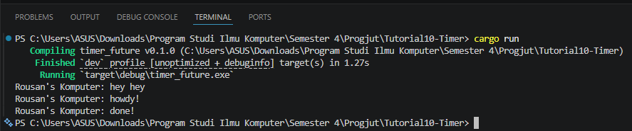
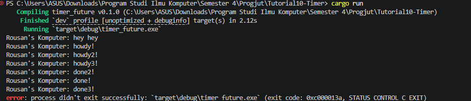
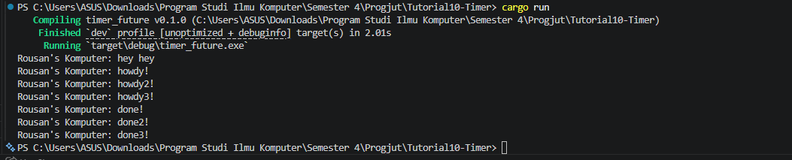

# Tutorial 10 - Timer

## Experiment 1.2: Understanding how it works

**Penjelasan:**
Berdasarkan hasil eksekusi di atas, teks `"hey hey"` dicetak lebih dulu dibandingkan `"howdy!"`, padahal di dalam kode, fungsi `spawner.spawn(...)` yang berisi `"howdy!"` dipanggil lebih awal daripada perintah `println!("... hey hey")`. 

Hal ini terjadi karena cara kerja *Asynchronous Programming* di Rust (khususnya sifat *Futures* yang *lazy*):

1. Ketika `spawner.spawn(...)` dipanggil, *task* (tugas) berupa *async block* tersebut **tidak langsung dieksekusi**. *Spawner* hanya membungkus tugas tersebut dan memasukkannya ke dalam antrean (sebuah *channel/queue*).
2. Karena eksekusi program utama bersifat *synchronous* dan tidak terblokir (non-blocking) oleh proses `spawn`, program langsung lanjut mengeksekusi baris berikutnya di fungsi `main`, yaitu mencetak `"hey hey"`.
3. *Task* yang kita *spawn* tadi baru akan benar-benar dijalankan ketika kita memanggil fungsi `executor.run()`. Di sinilah executor mulai menarik *task* dari antrean dan mengeksekusinya (*polling*), sehingga `"howdy!"` baru dicetak, lalu menunggu 2 detik, dan diakhiri dengan mencetak `"done!"`.

## Tutorial 1.3: Multiple Spawn and removing drop

**Penjelasan**

1. **Efek Spawning:** Ketika kita melakukan `spawner.spawn(...)` sebanyak tiga kali, kita memasukkan tiga buah *task* (Future) ke dalam antrean *executor*. Karena sifatnya *asynchronous*, *executor* dapat mulai menjalankan tugas ke-2 dan ke-3 segera setelah tugas sebelumnya mencapai titik "menunggu" (*awaiting* pada timer). Itulah sebabnya di terminal muncul `howdy!`, `howdy2!`, dan `howdy3!` hampir bersamaan sebelum ada pesan `done`.

2. **Analisis Komponen:**
   - **Spawner:** Bertugas sebagai pengirim (*sender*). Ia membungkus *future* ke dalam *task* dan mengirimkannya ke saluran (*channel*) antrean.
   - **Executor:** Bertugas sebagai penerima (*receiver*) dan pelaksana. Ia menarik *task* dari antrean dan memanggil fungsi `poll` sampai *future* tersebut selesai.
   - **Drop:** Berfungsi untuk menutup saluran pengiriman.

3. **Kasus `drop(spawner)` dihapus**

   Fungsi `drop(spawner)` sangat krusial untuk manajemen siklus hidup *channel* (saluran komunikasi) di Rust. Di dalam kode ini, `Spawner` memegang bagian pengirim (*Sender*) dan `Executor` memegang bagian penerima (*Receiver*).
  
   Jika baris `drop(spawner)` dikomentari atau dihapus, program **tidak akan pernah berhenti (hang/idle)** meskipun semua tugas sudah selesai dicetak (`done!`). 
   
   Hal ini terjadi karena fungsi `executor.run()` berisi loop `while let Ok(task) = self.ready_queue.recv()`. Saluran penerima (*receiver*) akan terus menunggu dan tetap terbuka selama masih ada objek *Spawner* (pengirim) yang hidup. Dengan menghapus `drop`, *executor* menganggap masih ada kemungkinan tugas baru akan dikirim di masa depan, sehingga ia terus menunggu (*blocking*) selamanya dan tidak pernah keluar dari fungsi `main`.

 
